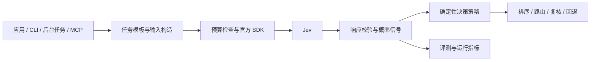

# Jev 使用研究与落地方案

研究日期：2026-09-21。范围：TypeSafe 官方文章、API/SDK 文档、官方 cookbook、jevai.org 社区页面、社区上下文裁剪项目，以及一个现有 Jev MCP 实现的案例审查。

本文区分官方能力、社区自述和本项目建议。已完成资料核对与静态代码审查；没有调用付费推理 API，没有实测本地准确率、延迟或费用，也没有修改现有服务实现。

## 1. 结论与推荐方向

**当前 MCP 不是接错了 Jev，而是只封装了推理原语，尚未形成可复用、可评测的决策能力。** 推荐把 Jev 建成独立的语义判断库，向 MCP、CLI、后台任务和应用服务提供同一套经过评测的任务模板。MCP 是入口之一。

Jev 最有价值的使用方式是：**代码准备事实和候选 → Jev 批量判断含义 → 代码结合概率和业务规则决定下一步。** 对话、解释、写代码由生成模型完成；计算、权限、数据校验由确定性代码完成。官方把这种模型定位为接收程序状态、输出类型化判断的 System One 模型。[官方介绍](https://typesafe.ai/blog/introducing-system-one-models-and-jev)、[产品文档](https://docs.typesafe.ai/introduction)

对本项目的优先级建议：

| 优先级 | 方向 | 推荐原因 |
| --- | --- | --- |
| 第一阶段 | 候选内容重排、固定分类 | 输入输出清楚，错误易观察，可与现有方法比较 |
| 第二阶段 | 技能/工具建议、抽取结果验证 | 能与现有 Agent 组合；需要宿主或应用集成 |
| 第三阶段 | 上下文裁剪、生成模型分流 | 潜在收益大，但误判会影响后续整条任务，需要端到端回放 |
| 不作为首个项目 | 通用安全裁判、任意问题打分 | 标准模糊，容易把主观概率当成授权或正确性证明 |

先交付一个能证明收益的 `rankCandidates`，比增加更多通用 MCP 工具更重要。

## 2. 官方与 jevai.org 到底是什么关系

### 2.1 来源可信度与协议边界

| 来源 | 能确认的定位 | 本项目如何使用 |
| --- | --- | --- |
| `typesafe.ai`、`docs.typesafe.ai` | 模型提供方及官方产品/API 文档 | 作为协议、模型限制和 SDK 的依据 |
| `typesafe-ai` GitHub 组织 | 官方文档链接指向的代码组织 | SDK、示例与对照实验工具 |
| `jevai.org` | 首页自称社区站，明确说官方文档/API 在 TypeSafe | 发现用例；其代理接口单独核实 |
| `tamaratran/fast-jev-compaction` | 独立作者维护的开源项目 | 研究设计与限制，不视为官方质量保证 |

**jevai.org 应按第三方社区服务处理。** 本次没有找到足够证据确认其运营主体与 TypeSafe 的隶属或授权关系；“第三方”是基于其自我定位作出的集成判断，不代表断言其有恶意。[社区首页](https://www.jevai.org/)

### 2.2 不能照搬社区页面的三个地方

1. 社区首页演示 `import typesafe`、`Client.decide()`、`model="jev-1"`；官方 Python quickstart 使用 `typesafe_sdk.TypeSafeClient().system_one()`。首页片段不能当作官方可运行 SDK 示例。[官方 quickstart](https://docs.typesafe.ai/introduction/quickstart)
2. 社区 API Hub 展示 `/v1/decisions`、`mode: "compaction"`、`schema_version`，并有 Coming soon 文案；Agent 页面又展示 `/api/v1/decisions` 和具体 preset。这些是社区自身的包装或示意，页面间也有成熟度表述差异。**官方原生请求是 `/v1/systemone` 的 `state + questions + model`，没有这些内置 mode。** [社区 API Hub](https://www.jevai.org/jev-api)、[社区 Agent 页面](https://www.jevai.org/agent)、[官方 API](https://docs.typesafe.ai/api)
3. 社区 Agent 页的配置示例使用明文 `http://www.jevai.org/mcp` 并附带 Bearer key。不要照抄该认证传输方式；若未来评估此服务，需要另行验证 HTTPS、数据流向、运营方和凭据范围。当前项目直接调用官方 HTTPS 即可。[社区 Agent 配置](https://www.jevai.org/agent)

可以借鉴它的“任务 preset + 调用说明”产品形态，但没有理由仅为使用 Jev 增加社区代理这一层。

## 3. Jev 的能力边界

### 3.1 三个原语如何选

| 原语 | 要回答的问题 | 返回值的正确理解 | 常见误用 |
| --- | --- | --- | --- |
| Noul | 某个命题成立吗？ | `noul = P(yes)`，无独立 confidence | 当成严重程度或质量分 |
| Choice | 在这些候选中选哪一个？ | `choice`、完整分布、confidence | 用单选表达多标签；没有“都不合适”出口 |
| Score | 某一个维度处于哪个等级？ | 等级索引的概率加权均值、分布、confidence | 当作任意连续数值回归或精确金额 |

例如“是否明确要求退款”用 Noul；“主要交给哪个团队”用 Choice；“当前功能受影响程度”用 Score。多标签则为每个标签分别建立 Noul。[原语说明](https://docs.typesafe.ai/primitives)、[Noul](https://docs.typesafe.ai/primitives/noul)

Score 的等级应是能独立理解的具体描述，例如“仅视觉问题”“功能受损但存在替代操作”“关键功能不可用且无替代操作”。三个等级编号是 0、1、2，`score = Σ i × P(i)`；相同均值可能来自不同分布，不能只保留均值。不要使用 `['1','2','3']` 或“比上一档更严重”。[Score 文档](https://docs.typesafe.ai/primitives/score)

Choice 要提供区分候选所需的名称和描述；如果答案空间不完备，应加 `none`、`other` 或 `insufficient_evidence`。候选相对排名很高，不等于绝对适用。[Choice 文档](https://docs.typesafe.ai/primitives/choice)

### 3.2 当前模型与集成约束

截至研究日，官方 Models 页列出：

| 项目 | 当前官方说明 |
| --- | --- |
| 固定模型 ID | `jev-1.13.0` |
| 稳定别名 | `jev-latest`，当前指向上述版本 |
| 输入 | 文本、承载文本及结构化字段的 JSON；不直接支持图片、音频、视频 |
| 上下文 | 整个请求 64k tokens；`state + 最长单个 question` 32k tokens |
| 价格 | 输入 $0.042 / 百万 tokens，输出免费 |
| 公开限流 | 250,000 tokens/s、1,200 requests/min；官方注明会动态调整 |
| 语言 | 英语表现最好，中文/CJK 必须独立评测 |

生产和评测固定模型版本；探索可用 `jev-latest`，但都要记录响应里的实际 `model`。这些是当前文档值，不是永久配额或 SLA。[Models](https://docs.typesafe.ai/models)

### 3.3 “不幻觉”不等于不会判断错

官方发布文章强调输出受限、不会生成任意字符串；这解决了输出落在指定类型/候选空间内的问题。**选项合法与选项正确是两回事。** Jev 仍可能选错事实、误解语义、受恶意输入干扰。[发布文章中的类型安全说明](https://typesafe.ai/blog/introducing-system-one-models-and-jev)

官方已列明 1.13 的弱点：精确计算、计数、日期比较、多层间接推理、无关长上下文、对抗内容。实践上，把算术留在代码；先筛选证据；问题直接指向字段；不要把 Jev 作为安全隔离边界。不同问题输出也不保证满足你期望的逻辑恒等式。[官方已知局限](https://docs.typesafe.ai/model-jaggedness/jev-1.13)

官网速度/成本倍数是特定评测的结果，其中 workflow eval 使用其他模型的参考概率，并不等于人工真值准确率。需要在你的中文任务和部署网络下测量端到端收益。[发布文章的评测说明](https://typesafe.ai/blog/introducing-system-one-models-and-jev)、[官方评测站](https://evals.typesafe.ai/)

## 4. 当前 MCP 的具体问题

案例来源：`zero-mcp` 项目的 `servers/node/typesafe/src/index.ts`，截至研究日共 214 行。本节及后续目录改造建议针对该案例。

已经做对的部分：官方 endpoint、Bearer 认证、三个原语请求形状，以及 `typesafe_judge` 允许同一 state 混合多问。请求失败也会返回 MCP `isError`。

| 位置 | 观察到的问题 | 实际影响 | 建议 |
| --- | --- | --- | --- |
| L18–22、L176–178 | `questions` 和 payload 大量使用 `any` | 错误类型、缺失 criteria 等推迟到远端才发现 | 用判别联合定义三种 question，并验证输入 |
| L53、91、133、175 | 单问只接收字符串；judge 接收字符串或对象，不支持顶层数组 | 原生结构能力在不同工具间不一致 | 共用 JSON state schema |
| L54、92、134 | 单问 instructions 只接收字符串 | 无法直接传结构化的问题及目标对象 | 开放字符串/对象/数组 |
| L93–95、135–137 | Choice/Score 无数量约束，Choice 只接受字符串描述 | 接受无意义或超限 rubric，且不能用官方 null/结构化描述 | Score 限 2–10；Choice 上限 255，本地约定至少 2 |
| L50–83 | Noul 无 criteria 参数 | 无法显式表达 yes/no 边界 | 提供可选 true/false 描述 |
| L24–40 | 无显式超时、取消或重试策略；JSON 不校验 | 卡顿、过载失败、缺字段无法分类处理 | SDK 或完整 transport 层；设置总时间预算 |
| L55 等 | 默认 `jev-latest`，工具任意传 model | 模型变更可能破坏阈值可比性 | 生产固定版本，记录实际模型 |
| L69–75 等 | 只返回格式化 JSON 文本 | 机器消费者还要重新解析；结果缺统一契约 | 在确认 MCP SDK/客户端支持后提供结构化结果与输出 schema |
| 全文件 | 无固定任务 rubric、策略版本、评测或业务阈值 | 同一任务换个提问就变成另一个分类器 | 建立版本化任务模板 |
| README | 只解释安装和原语 | Agent 不知道何时该批量调用，何时不值得调用 | 补使用准则、正反例和预设入口 |

这里的 schema 子集不意味着每次调用都会失败；真正的损失是表达能力、可复现性和稳健性。仅从代码不能断言你实际用了多少串行调用或效果有多差，需补运行日志。

**架构层面更大的问题：** 如果主 Agent 已能顺手判断一个简单问题，却还要生成工具调用、复制上下文、读取概率再继续推理，增加的往返可能没有收益。Jev 更适合一次处理一批候选、重复业务判断，或直接嵌入每条请求都会经过的程序节点。

## 5. 正确组织 state、questions 和代码

### 5.1 state 是证据，questions 是判断标准

建议 state 使用具名字段，例如 `{ request, candidates, relevant_policy, observed_facts }`。只带当前判断必需的上下文，保留来源、时间和候选 ID。模型不会自动读你的仓库、数据库或网络；缺失的事实必须先获取。[State 文档](https://docs.typesafe.ai/concepts/state)

问题 ID 只是响应关联键，**不会送入模型推理**。以下写法错误：

```json
{ "is_candidate_17_relevant": { "type": "noul", "instructions": "Is it relevant?" } }
```

正确做法是在 instructions 写全对象、关系和判断条件，例如“候选 `candidates[0]` 是否包含能直接帮助完成 `request` 的操作说明？”。如果用结构化 instructions，把候选数据与问题放在同一对象里，不依赖 ID 藏语义。[官方 API](https://docs.typesafe.ai/api)

### 5.2 一次问多个原子问题，不把整个工作流塞进一问

不推荐：“综合判断该如何处理这个请求，并考虑业务风险、用户意图、技术难度和紧急程度。”

推荐拆成：“主要意图是什么？”“是否要求人工？”“是否涉及生产环境？”“现有证据是否足够定位到某个已知问题？”然后用代码处理组合规则。

同一请求里的问题分别看同一 state，不读取彼此答案。能事先构造的问题一起发，代码忽略暂时不需要的答案；只有后续必须依赖前一个结果获取新证据、构造新对象或新候选时，才分两轮。[原语的多问说明](https://docs.typesafe.ai/primitives)、[并行提问模式](https://docs.typesafe.ai/patterns/fan-out)

### 5.3 批处理有两个层次

- **同一状态、多维判断：** 一篇文章的多个标签、一个请求的多个属性，天然适合同一次调用。
- **一批对象：** 可把对象列表放进 state、每个对象建立清楚指向它的问题；也可按对象发起有限并发。选择取决于 token 上限、状态相关性、尾延迟和评测结果。

不要为节省请求数把互不相关的长文档塞进巨大 state。分批时同时控制“state 加全部问题”和“state 加最长问题”两个预算；问题与 criteria 也占输入 tokens。评测比较单问串行、同状态批问和分组并发三种策略。

### 5.4 概率、confidence 与业务决策分开

`confidence` 是分布形状的统计量，并非另一条独立证据，也不能理解为“本次答案正确率 90%”。官方没有在该概念页给出可依赖的通用计算公式，因此直接保留返回值，不自行猜测其算法。[Confidence 文档](https://docs.typesafe.ai/confidence)

本项目建议：

- Noul 使用 yes / uncertain / no 三路；例如 `>=0.8`、`(0.2,0.8)`、`<=0.2` 仅可作为待评测起点。
- Choice 可结合第一名概率、前两名差值、confidence 与 `none`；这些指标相关，不能当独立概率相乘。
- Score 保存完整分布；必要时在代码求“落入严重档”的总概率。
- 多个 Noul 在计算上分开评估，不代表事件统计独立；`pA*pB` 不能无条件当联合概率。
- 缺少答案、超时、响应异常返回 `unavailable`，与语义不确定 `abstain` 分开；两者均不得伪造成“低风险”。

对于二分类，若只有误报成本 `C_FP` 与漏报成本 `C_FN`，且概率适用、正确决策损失视为零，最小期望损失阈值为 `C_FP / (C_FP + C_FN)`。这是决策理论推导，不是 Jev 的产品参数。复杂流程另设复核成本和拒答路径，最终用真实样本验证。

## 6. 推荐架构：独立判断库 + 多入口



建议的目录是未来改造草案，本次没有创建这些实现：

```text
packages/jev-core/
  src/client.ts             # 官方 SDK、取消、超时、调用指标
  src/contracts.ts          # 统一输入输出和响应校验
  src/tasks/rank.ts         # 固定 relevance rubric
  src/tasks/classify.ts     # 固定类别与判定边界
  src/policies/             # 阈值、拒答、回退
  evals/                    # 标注样本、评测、结果比较
servers/node/typesafe/
  src/index.ts              # MCP 适配，调用核心库
apps/jev-cli/               # 可选；先有核心库再加
```

当前根 workspace 仅匹配 `servers/node/*`；采用以上目录时需同步增加 `packages/*`，引入 CLI 时再增加 `apps/*`。不要只移动文件却漏掉构建依赖。

### 6.1 公共结果契约

下面是本项目拟定的封装结果，**不是官方 API 原生响应**：

```json
{
  "task": "rank_candidates",
  "rubricVersion": "relevance-v1",
  "policyVersion": "ranking-v1",
  "model": "jev-1.13.0",
  "status": "ok",
  "signals": {},
  "decision": { "candidateIds": ["doc-17"], "reasonCode": "ranked" },
  "metrics": { "elapsedMs": 0, "inputTokens": 0 }
}
```

`status` 建议为 `ok | abstain | unavailable`。`signals` 保留需要的原始分布；`reasonCode` 由触发的代码分支产生，不冒充模型生成的解释。指标示例中的 0 是占位值，实际必须测量。

### 6.2 MCP 工具如何调整

保留现有四个名称以兼容已有调用；单问工具共用同一实现，并在描述中建议同状态多问优先调用 `typesafe_judge`。不要一次性暴露十几个未评测预设。

先新增两个稳定入口：

| 建议工具 | 输入 | 服务端负责 | 输出 |
| --- | --- | --- | --- |
| `typesafe_rank` | query、候选 ID/内容、topK | 固定相关性问题、分批、校验、排序 | 候选 ID、信号、状态 |
| `typesafe_classify` | 预设名、待分类材料 | 类别定义、边界、阈值与复核策略 | 类别或 abstain |

通用 judge 用于探索；正式流程调用版本化预设。Agent 不应在每次请求临时重写生产 rubric 和阈值。

MCP 的工具被列出，并不意味着它能自动在每次模型推理前执行、截获工具调用，或替换宿主的上下文压缩。要获得这些效果，必须集成到支持相应扩展点的宿主或自建 Agent 编排程序中。普通应用则直接 import 核心库，无须绕经 MCP。

### 6.3 transport 与运行要求

优先采用已有的官方 `@typesafe-ai/sdk`，而不是继续重复维护 HTTP 细节。它提供 TS 类型推导和重试机制；仍需在业务层验证响应是否覆盖全部问题、选项是否属于本次候选，以及数值是否有限且在范围内。[JavaScript SDK](https://docs.typesafe.ai/sdk/javascript)

建议实现要求：

- 区分认证/请求错误与瞬时错误；前者不盲目重试，后者有限退避。
- SDK timeout 是每次尝试的毫秒数，不等于包括重试等待的总 deadline；总预算由调用层控制。交互路径与离线任务分开配置。[SDK 配置](https://docs.typesafe.ai/sdk/javascript/api/interfaces/TypeSafeClientConfig)、[RetryPolicy](https://docs.typesafe.ai/sdk/javascript/api/interfaces/RetryPolicy)
- 并发和 token 预算都做限制；用户取消时传播取消信号。
- 日志默认仅记录任务版本、模型、耗时、token、状态；原文记录需脱敏且有明确用途。
- 缓存键包含模型版本、state、rubric、候选集及顺序；业务策略变更应重新应用策略，避免复用陈旧最终动作。
- MCP stdio 的日志只写 stderr；引入 SDK 时审查 logger 配置。
- 密钥只在服务端环境或凭据存储中；浏览器通过自己的后端调用。

## 7. 不限于 MCP 的实用场景

### 7.1 首选：搜索结果、知识片段与候选内容重排

流程：检索先产生例如 20 个候选 → 每个候选一个相关性问题 → 同批评估 → 代码排序取 topK → 主模型读取入选原文。

本项目建议首版只调整排序，不直接删除全部低分候选；保留原始检索结果作为回退。这样可以在较低风险下观察 topK 命中率和最终回答质量。没有召回的材料，Jev 无法找回来。

如果以后增加“与问题前提矛盾”和“包含指令性内容”等维度，应把冲突证据单独标注，不因不支持预设结论就删除。官方 RAG cookbook 展示了相关性、可用性、矛盾和注入信号分开判断的模式；其过滤不能替代安全边界。[官方 RAG 示例](https://docs.typesafe.ai/cookbooks/classifying_rag_passages)

### 7.2 固定分类与后台工作流

用于问题反馈归类、文档标签、告警分流、用户意图等。调用位于消息队列消费者或后端服务中，不需要 LLM 先决定是否调用工具。

例如用户反馈到达后，代码同时询问主要类别、是否请求人工、影响程度，随后创建标签与待处理队列。对订单状态、金额、时间窗口等能查数据库或计算的条件，先由代码确定。首期输出建议分类，评测稳定后再自动写入低风险标签。

### 7.3 技能/工具推荐

候选较少且信息充足时可一次 Choice 加 `none`。候选描述短、能力相似时，采用两阶段：第一轮排名；代码加载少量入选工具的完整说明；第二轮判定绝对适用性并允许全部拒绝。新增事实解释了第二次调用的必要性。

官方 skill suggestion cookbook 使用这样的两阶段设计；其中的实验模型、数据和阈值属于特定示例，不能视为你的工具目录上的保证。[官方技能建议示例](https://docs.typesafe.ai/cookbooks/skill_suggestion)

本项目中只有在工具选择经常出错或目录明显变大时才上这一层；明确指定工具的请求可直接执行既定路由，避免额外判断。

### 7.4 抽取：候选生成 → 选择 → 原文复制

Jev 不自由生成地址、金额或段落，但可以从已有候选中选出正确字段。先用解析器/正则/OCR/生成模型生成候选，并保留原始片段位置；Jev 选择候选 ID；代码复制原文、校验及标准化。

例如发票上的多个金额由解析器全部定位，Jev 判断哪个是应付总额，代码用 decimal 处理金额。始终有“未找到”出口；候选来源本身若错，受限选择无法修复。[官方候选抽取示例](https://docs.typesafe.ai/cookbooks/pre_parsed_value_extraction_cookbook)

### 7.5 上下文裁剪：后续实验，不宜第一步全量启用

`fast-jev-compaction` 的核心是让 Jev 判断工具调用/结果是否还需保留，由代码保留、截短或移出当前上下文，并维护调用与结果的配对。它不是让 Jev 写摘要。其 README 也说明，判断 state 中省略了工具结果正文，长度估算与重复 state 存在局限；旧 token 限制不能覆盖当前官方 Models 页。[社区项目原始仓库](https://github.com/tamaratran/fast-jev-compaction)

本项目若借鉴，建议额外设计：

- 原始历史完整归档，只构造裁剪视图；误裁剪可以恢复。
- 硬保留用户目标、约束、未解决错误、最近关键改动及不可重取结果。
- 给判断器必要的结果摘要或证据摘录，避免只看工具名猜测价值。
- 优先按“是否值得保留”做保守策略；信息缺失或服务异常时保留。
- 用真实长任务回放比较完成率、返工次数和 token，不只看压缩率。

这种接入需要宿主对上下文构造的控制权。不能仅新增 MCP tool 就宣称已经替换任何客户端的内置压缩。

### 7.6 生成模型分流与验证

Jev 可作为廉价语义信号节点：简单任务走较小生成模型，复杂/不确定任务走强模型；或小模型先提取，再验证是否需要升级。需要同时记录分流成本、漏升级损失和最终质量。

不要让 Jev 在没有测试证据时判断“代码一定正确”，也不要每次强模型回答后无条件再问一遍 Jev。先验证新增判断能减少多少失败或昂贵调用。

## 8. 一个完整的最小接入示例

以下 TypeScript 展示“固定问题 → 一次批量判断 → 代码路由”。它是方案样例，未加入项目、未实测；阈值与 3 秒 timeout 均为待评测的项目参数，不是官方推荐值。示例仅返回分流建议，不执行副作用。

```ts
import { TypeSafeClient, choice, noul, score } from "@typesafe-ai/sdk";

const client = new TypeSafeClient({
  defaultModel: "jev-1.13.0",
  timeout: 3_000,
  retry: { maxRetries: 0 }, // 此交互样例快速回退；后台任务可另设重试
});

const questions = {
  category: choice("What is the primary subject of `message`?", {
    billing: "Charges, invoices, subscriptions, or requested refunds.",
    technical: "A software feature fails or behaves incorrectly.",
    other: "A different subject, or too little evidence to classify.",
  }),
  wantsHuman: noul(
    "Does `message` explicitly request help from a human support agent?"
  ),
  impact: score("What functional impact is described in `message`?", [
    "No loss of software functionality is described.",
    "A function is impaired, but the user describes a working alternative.",
    "A necessary function is unavailable and no working alternative is described.",
  ]),
};

export async function triage(message: string) {
  try {
    const result = await client.systemOne({ state: { message }, questions });
    // 正式实现：在这里进行按本次 questions 的运行时响应校验。
    const { category, wantsHuman, impact } = result.answers;
    const values = [category.confidence, wantsHuman.noul];
    if (values.some(v => !Number.isFinite(v) || v < 0 || v > 1)) {
      throw new Error("Invalid decision signal");
    }

    let route: "human" | "review" | "billing" | "technical";
    if (wantsHuman.noul >= 0.8) route = "human";
    else if (
      wantsHuman.noul > 0.2 ||
      category.confidence < 0.8 ||
      category.choice === "other"
    ) route = "review";
    else route = category.choice;

    return {
      status: route === "review" ? "abstain" : "ok",
      route,
      model: result.model,
      rubricVersion: "triage-v1",
      policyVersion: "triage-policy-v1",
      signals: { category, wantsHuman, impact },
      usage: result.usage,
    };
  } catch {
    return { status: "unavailable", route: "review" };
  }
}
```

示例里 `impact` 是独立信号，供人工队列展示；没有把它当作“退款资格”或擅自执行动作的依据。正式客户端还应分类记录错误、取消和实际耗时。

## 9. 怎么证明“用得更好”

### 9.1 先建立你自己的样本集

建议先选一个任务收集约 200–500 条代表性样本，作为启动规模而非统计充分性的承诺。包括中文、英文、混合语言、否定表达、多意图、证据不足、所有候选均不适用、长上下文和恶意引导。

每条记录输入、人工标签/可接受候选、业务代价与判定理由。近重复内容和同一会话放在同一数据划分里，避免泄漏；分开发集与留出测试集，阈值只在开发集调。高风险或罕见错误需要更多有针对性的样本。

### 9.2 对比对象与指标

| 对比 | 回答的问题 |
| --- | --- |
| 现有检索/规则或不加 Jev | 是否真的需要额外模型？ |
| 当前通用 MCP 用法 | 固定模板和批处理是否改善效果？ |
| 固定 rubric 的 Jev 直连 | 模型判断本身的质量、延迟、成本如何？ |
| 相同任务的生成模型 | 节省费用是否值得质量损失？ |

模型对比尽量保持输入证据和任务定义一致；产品对比再计入完整编排成本。官方提供的 System One Adapter 可辅助同题比较，但应同时测量适合各自模型的实际产品路径。[官方对照适配器](https://github.com/typesafe-ai/system-one-adapter-python)

必须记录：

- 分类：precision、recall、混淆矩阵；自动处理覆盖率与自动处理错误率同时看。
- 排序：Recall@K、NDCG 或人工相关性，以及最终任务成功率。
- 概率：Brier score、可靠性分箱图；confidence 单独检验与实际错误率的关系。
- 系统：p50/p95/p99 端到端延迟、错误/超时率、重试率、输入 tokens、每个成功任务的总成本。
- 稳定性：同义改写、候选顺序变化、重复请求和模型升级前后的差异。

**评测准入建议：** 先影子运行，只记录不改变原行为；排序先小流量启用并保留回退；自动分类必须在预先确定的错误成本约束内达到可接受覆盖率。不根据“看起来 confidence 很高”上线。

### 9.3 成本如何估算

按当前官方输入单价，若一次调用实际计费输入为 5,000 tokens，纯 Jev 推理费约为 `5000 / 1,000,000 × $0.042 = $0.00021`；10 万次约 $21。这个估算不含重试、上下文重复、检索、主模型和宿主工具往返成本。[当前定价](https://docs.typesafe.ai/models)

同一 state 的 N 个单问调用约输入 `N×S + ΣQ_i`；批问约为 `S + ΣQ_i`，其中 S 为 state，Q 包含 instructions 与 criteria，具体以 usage 为准。延迟则必须测量，不能把每个问题的模型耗时简单相加或承诺固定倍数。

## 10. 实施路线与验收

| 阶段 | 交付物 | 验收依据 |
| --- | --- | --- |
| A：明确基线 | 选定 rankCandidates 或分类任务，建立标注集与当前结果 | 有可复现基线，不依赖主观印象 |
| B：补齐基础库 | 官方 SDK、统一 schema、响应校验、模型固定、错误和指标 | 非法输入/缺字段/超时/限流能正确区分；旧工具兼容 |
| C：第一个任务 | 固定 rubric、独立策略、CLI/脚本评测入口 | 留出集质量和端到端收益达到任务目标 |
| D：接入 MCP/应用 | 薄 MCP wrapper 或后端调用，影子与小流量开关 | 有回退；指标可追溯至模型/rubric/policy 版本 |
| E：扩展 | 技能建议、抽取校验，之后才做上下文裁剪 | 每种新任务单独评测，不能沿用上一任务阈值 |

必要测试集中在边界：请求构造与多问打包、候选 ID 映射、Score 等级数量、缺失响应、异常数值、取消/超时、429/529、abstain/unavailable 策略。使用 mock transport 验证工程行为，另用受控的真实 API 集做模型评测；类型检查通过不能证明模型好用。

**建议首先实施 B + 一个重排任务，并用 A/C 的评测决定是否扩大投入。** 当前四个原语可以继续保留；重点是让调用变成有任务标准、有概率策略、有回归数据的能力，而不是继续增加“请模型再判断一下”的工具。

## 11. 研究边界与待验证项

- 本次结论建立在当前公开资料和静态代码上，未验证账号实际权限、配额、官方服务可用性。
- 未使用 jevai.org 的登录、API key 或远程 MCP；其功能是否实际可用仍未验证。
- 未复现官方 benchmark 或社区插件效果；案例说明架构可行，不证明本项目能获得相同收益。
- 下一轮应验证中文准确率、本地网络尾延迟、官方 SDK 固定版本与现有 MCP SDK 的结构化输出兼容性。
- 本文涉及的数字、阈值和示例已区分为官方当前参数、计算示例或项目建议；上线以前应以实际测量和回归结果为准。
